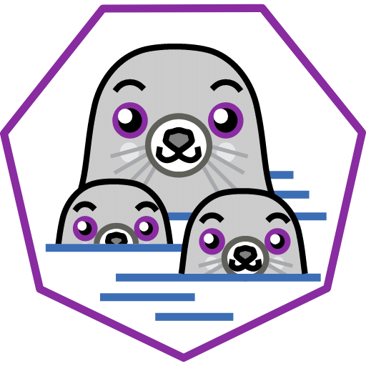

Create your own Debian workspace with Podman
===========
<p align="left">
	
	
</p>

## Objective 🔍
The objective of this tutorial is setup a container with everything necessary to have a minimal workspace environment.

## Description 📖
If you are an owner of a WebPanel (WP) or a TouchController (TC), and you need to create your own clean workspace to develop and deploy some type of application (without modifying the host), or to install new packages, this tutorial will guide you into creating a minimal debian environment with everything you need.

## Prerequisites 🛠️
- A [WebPanel (WP)](https://www.pixsys.net/hmi-e-ipc/webpanel) or [TouchController (TC)](https://www.pixsys.net/dispositivi-logica-programmabile/hmi-codesys)
- Basic knowledge of Linux
- Basic knowledge of [podman](https://podman.io/) and containers

## Steps 👣
1. Connect to the device via SSH using the `user` account:
	
	```bash
	ssh user@<DEVICE_IP>
	```

2. Navigate to the `/data/user` folder:

	```bash
	cd /data/user
	```

3. Create a dedicated folder to keep everything you will create during this tutorial:

	```bash
	mkdir debian-env
	cd debian-env
	```

4. Create a dedicated folder to store your persistent data or to share files with your container

	```bash
	mkdir data
	```

5. Depending on your current needs, run the following command paying attention on what every option actually does:

	```bash
	podman run -it --name debian-container -w /data --userns=keep-id -u $(id -u):$(id -g) --group-add keep-groups -v $(pwd)/data:/data -p <HOST_PORT>:<CONTAINER_PORT> -e <MY_ENV>=<MY_ENV_VALUE> --device <HOST_DEVICE>:<CONTAINER_DEVICE> docker.io/debian:latest /bin/bash
	```

	- `-w /data` is used to set the working directory of your container (the current directory once you access the container)

	- `-v $(pwd)/data:/data` is used to map the `/data/user/debian-env/data` to the `/data` folder of your container, so that you can share file and have persistent storage for your container.

	- `--userns=keep-id -u $(id -u):$(id -g)` is used to use the current host user (`user` in this case) as user of the container. This way, everything you will create inside the container will have `user` as owner

	- `--group-add keep-groups` is used to preserve the groups of your current user. This can be useful if you need to access some device that need you to belong to a specific group, e.g. the group `dialout` if you need to communicate with serial devices

	- use `-p <HOST_PORT>:<CONTAINER_PORT>` if you need to run some type of service (database, web-server) inside your container, and your host needs to access it. For instance, if you are running a web-server that uses port 3000 inside your container, and you want to have the service exposed on port 4000 of your host, use `-p 4000:3000`

	- use `-e <MY_ENV>=<MY_ENV_VALUE>` if you need to pass some environment variables to your container. For instance, if your container needs to run and publish a web-page to a specific public domain name, use `-e MY_DOMAIN_NAME=example.com`. To make sure you passed correctly the variables, try to print the variable while inside the container:
		```bash
		cat $MY_DOMAIN_NAME
		# the result output should be
		# example.com
		```

		podman exec -it debian-container /bin/bash
	
	- use `--device <HOST_DEVICE:<CONTAINER_DEVICE>` if you need to access some type of device that is mapped to your host from your container. For instance, if you need to communicate with the serial interface `/dev/ttyUSB0` from inside the container, use `--device /dev/ttyUSB0:/dev/ttyUSB0`


